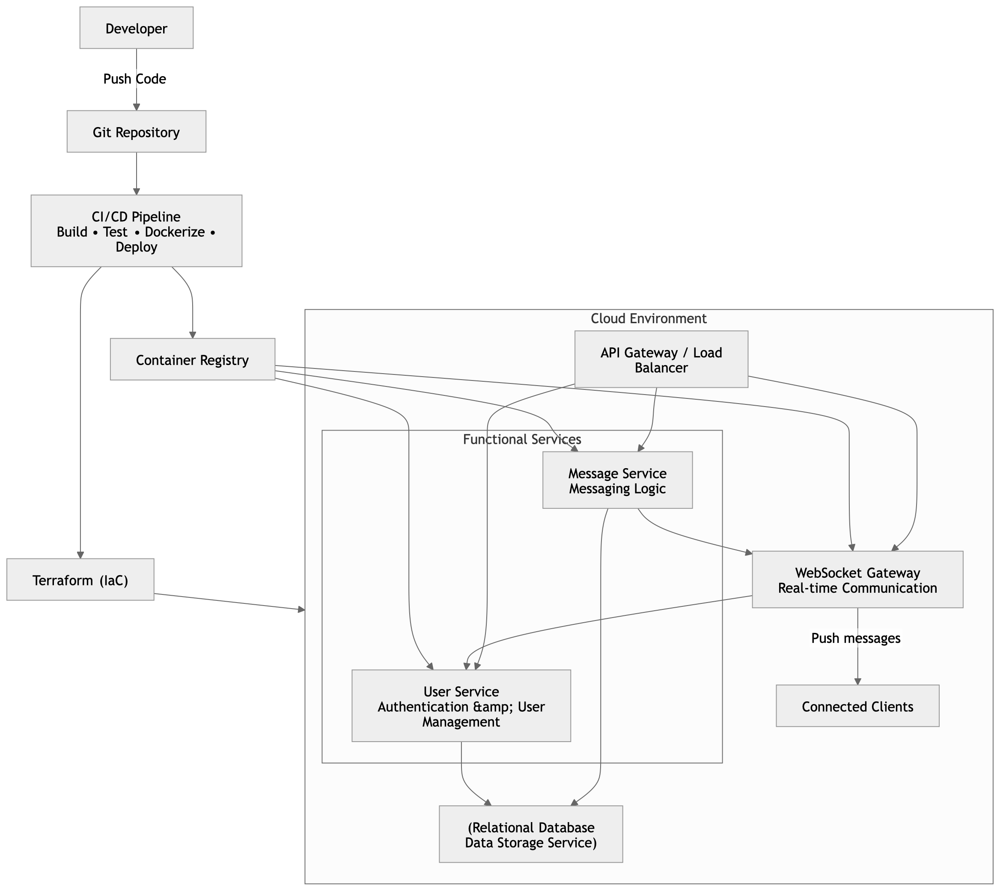

# Architecture

## Diagram

> The diagram shows the original design including a WebSocket gateway for real-time push. The current submission implements the REST path only: `Developer → Git → CI/CD → Container Registry → ALB → user-service / message-service → Postgres`. The WebSocket gateway and connected-client paths are not part of this build.

## Components (as shipped)

### Application tier
- **`user-service`** — Node.js 20 / Express. Handles `POST /users/register`, `POST /users/login`, `GET /users/:id`, `GET /health`. Stores users in Postgres; signs JWTs with `JWT_SECRET`. Source: `user-service/src/`.
- **`message-service`** — Node.js 20 / Express. Handles `POST /messages`, `GET /messages/:user1/:user2`, `GET /health`. Source: `message-service/src/`.

Both services are stateless and horizontally scalable. They share one Postgres database but never share in-memory state.

### Data tier
- **Amazon RDS for PostgreSQL 16** — single `db.t3.micro` instance, encrypted, in private subnets, reachable only from the ECS task security group on port 5432. Schema is bootstrapped idempotently on service startup: each service's `index.js` runs its own `CREATE TABLE IF NOT EXISTS …` against the shared pool defined in `db.js`.

### Edge / network
- **Application Load Balancer** in two public subnets, accepting `HTTP :80` from the internet.
  - Default rule → `user-service` target group (so `/health` and `/users/*` land here).
  - Path rule `/messages*` → `message-service` target group.
- **VPC** `10.20.0.0/16` with two AZs, two public subnets (ALB + NAT) and two private subnets (ECS tasks + RDS).
- **Single NAT Gateway** lets private-subnet ECS tasks pull from ECR and AWS Secrets Manager.

### Compute
- **ECS Fargate cluster** runs both services as separate ECS services, each with its own task definition. Tasks live in private subnets with no public IP.
- Each task pulls an image from its dedicated **ECR** repository (`chat-user-service`, `chat-message-service`).

### Secrets and config
- `DB_PASSWORD`, `JWT_SECRET` → AWS Secrets Manager, mounted into tasks via the ECS task definition's `secrets` block.
- Non-sensitive config (`DB_HOST`, `DB_PORT`, `DB_USER`, `DB_NAME`, `PORT`, `DB_SSL`) → ECS task definition `environment` block, populated from Terraform.

### Observability
- Container `stdout`/`stderr` → **CloudWatch Logs** via the `awslogs` driver. Log groups: `/ecs/chat/user-service`, `/ecs/chat/message-service`.
- ALB target groups poll `GET /health` on each task every 30 s.

## Request flow

`client → ALB :80 → ALB listener rule → target group → ECS task (private subnet) → Postgres (private subnet)`

`/users/register` example:
1. Client POSTs JSON to `http://<alb-dns>/users/register`.
2. ALB matches the default rule and forwards to the `chat-user-tg` target group.
3. The target group sends the request to a healthy `user-service` task on port 3001.
4. `user-service` bcrypt-hashes the password, INSERTs into `users` (Postgres), and returns the new row.

## Deployment flow

`developer push to main → GitHub Actions → docker build → push to ECR (tags :latest and :<sha>) → aws ecs update-service --force-new-deployment → ECS rolls tasks to the new image → ALB health check → traffic shifts`

See `.github/workflows/deploy.yaml`.

## Trade-offs and notes

- **Single NAT Gateway** (one AZ) — cheaper for a class demo, but a single point of failure. Production would use one per AZ.
- **`:latest` tag** is used by the ECS task definition so a `force-new-deployment` is enough to roll out new code. Each image is also pushed with its commit SHA for auditability.
- **Local Terraform state** — `infrastructure/terraform.tfstate` is on the developer's machine. Fine for a one-person demo; not safe for a team. A real deployment would use the S3 + DynamoDB backend.
- **`lifecycle.ignore_changes = [task_definition, desired_count]`** on the ECS services means CI is the source of truth for which image revision is live, and Terraform won't fight CI.
